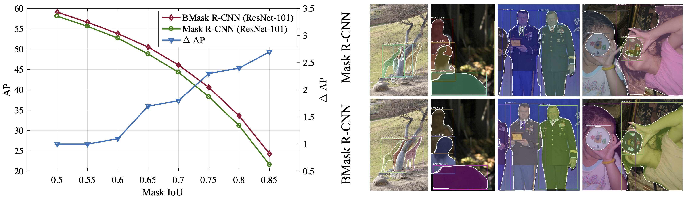

# BMaskR-CNN

This code is developed on [*Detectron2*](https://github.com/facebookresearch/detectron2)

> [**Boundary-preserving Mask R-CNN**](https://arxiv.org/abs/2007.08921)  
> *ECCV 2020*    
> Tianheng Cheng, Xinggang Wang, Lichao Huang, Wenyu Liu

<div align="center">

</div>

*Video from [Cam看世界](https://youtube.com/channel/UCBaNgnYE2i5jqgr7EFfP9zQ)* on Youtube.

## Abstract
Tremendous efforts have been made to improve mask localization accuracy in instance segmentation. 
Modern instance segmentation methods relying on fully convolutional networks perform pixel-wise classification, 
which ignores object boundaries and shapes, leading coarse and indistinct mask prediction results and imprecise localization. 
To remedy these problems, we propose a conceptually simple yet effective Boundary-preserving Mask R-CNN (BMask R-CNN) to 
leverage object boundary information to improve mask localization accuracy. BMask R-CNN contains a boundary-preserving mask 
head in which object boundary and mask are mutually learned via feature fusion blocks. As a result,the mask prediction 
results are better aligned with object boundaries. Without bells and whistles, BMask R-CNN outperforms Mask R-CNN by a 
considerable margin on the COCO dataset; in the Cityscapes dataset,there are more accurate boundary groundtruths available, 
so that BMaskR-CNN obtains remarkable improvements over Mask R-CNN. Besides, it is not surprising to observe
that BMask R-CNN obtains more obvious improvement when the evaluation criterion requires better localization (e.g., AP<sub>75</sub>) 

<div align="center">

</div>


## Models

#### COCO

| Method | Backbone | lr sched | AP | AP<sub>50</sub> | AP<sub>75</sub> | AP<sub>s</sub> | AP<sub>m</sub> | AP<sub>l</sub> | download |
| :--    |   :---:  |   :---:  |:--:|      :---:      |      :---:      |      :---:     |      :---:     |      :---:     |  :---:   |
| Mask R-CNN  | R50-FPN | 1x | 35.2 | 56.3 | 37.5 | 17.2 | 37.7 | 50.3 | - | 
| PointRend   | R50-FPN | 1x | 36.2 | 56.6 | 38.6 | 17.1 | 38.8 | 52.5 | - | 
| BMask R-CNN | R50-FPN | 1x | 36.6 | 56.7 | 39.4 | 17.3 | 38.8 | 53.8 | [model](https://1drv.ms/u/s!AiO3BIXgPy5wgQPnrfnAtiyPDPg2?e=C30spg) |
| BMask R-CNN | R101-FPN| 1x | 38.0 | 58.6 | 40.9 | 17.6 | 40.6 | 56.8 | [model](https://1drv.ms/u/s!AiO3BIXgPy5wgQS7Rali6QkXnrS3?e=LuTAup) |
| Cascade Mask R-CNN  | R50-FPN | 1x | 36.4 | 56.9 | 39.2 | 17.5 | 38.7 | 52.5 | - |
| Cascade BMask R-CNN | R50-FPN | 1x | 37.5 | 57.3 | 40.7 | 17.5 | 39.8 | 55.1 | [model](https://1drv.ms/u/s!AiO3BIXgPy5wgQbCmylIyL4Z4GFh?e=MNrgaD)  |
| Cascade BMask R-CNN | R101-FPN | 1x | 39.1 | 59.2 | 42.4 | 18.6 | 42.2 | 57.4 | [model](https://1drv.ms/u/s!AiO3BIXgPy5wgQcIpRDSMUKHVgMM?e=on6XLj)  |


#### Cityscapes

* Initialized from ImagetNet pre-training.

| Method | Backbone | lr sched | AP | download |
| :--    |   :---:  |   :---:  |:--:|  :---:   |
| PointRend   | R50-FPN | 1x | 35.9 |    -     | 
| BMask R-CNN | R50-FPN | 1x | 36.2 | [model](https://1drv.ms/u/s!AiO3BIXgPy5wgQXy09QVGx89O3Fq?e=VwMp2b)|


## Visualizations



**Left:** AP curves of Mask R-CNN and BMask R-CNN under different mask IoU thresholds on the COCO *val2017* set, 
the improvement becomes more significant when IoU increases. 
**Right:** Visualizations of Mask R-CNN and BMask R-CNN. 
BMask R-CNN can output more precise boundaries and accurate masks than Mask R-CNN.

## Usage

Install Detectron2 following the official [instructions](https://detectron2.readthedocs.io/tutorials/install.html)

### Training

specify a config file and train a model with 4 GPUs

```bash
cd projects/BMaskR-CNN
python train_net.py --config-file configs/bmask_rcnn_R_50_FPN_1x.yaml --num-gpus 4
```

### Evaluation

specify a config file and test with trained model

```bash
cd projects/BMaskR-CNN
python train_net.py --config-file configs/bmask_rcnn_R_50_FPN_1x.yaml --num-gpus 4 --eval-only MODEL.WEIGHTS /path/to/model
``` 

## Citation

```
@article{ChengWHL20,
  title={Boundary-preserving Mask R-CNN},
  author={Tianheng Cheng and Xinggang Wang and Lichao Huang and Wenyu Liu},
  booktitle={ECCV},
  year={2020}
}
```

